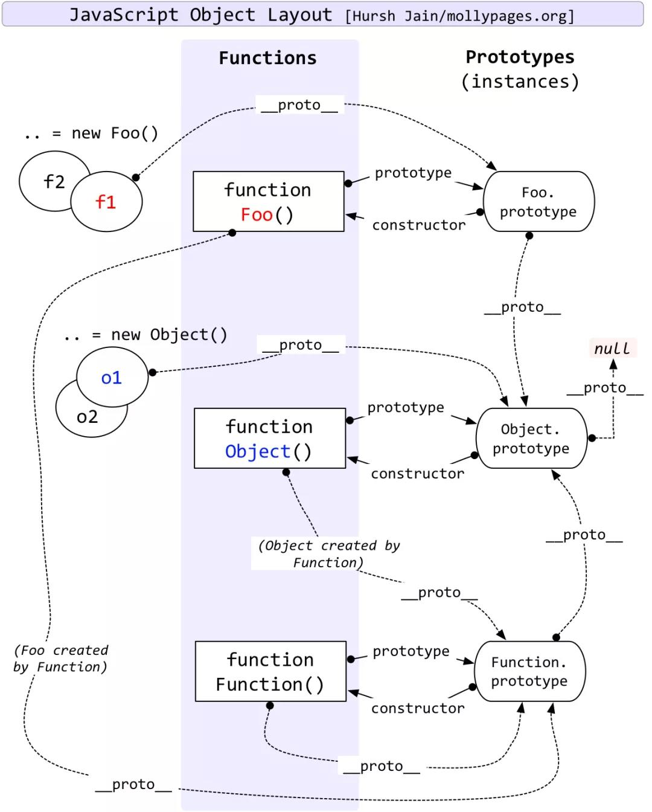
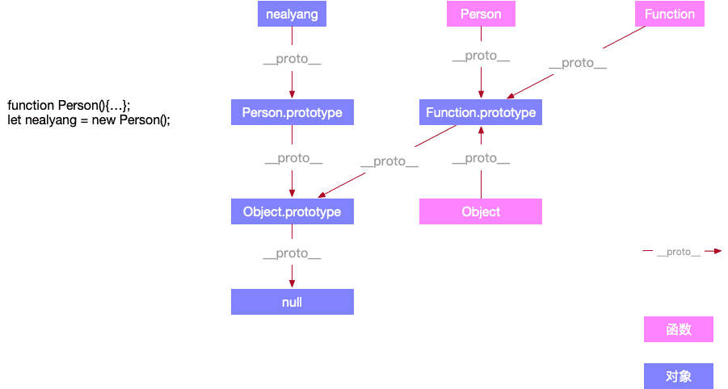
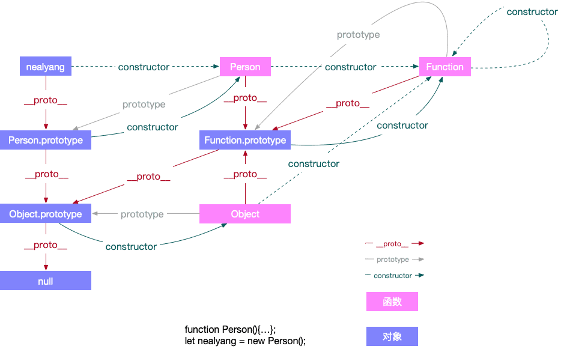

### 原型

在 js 中我们是使用构造函数来新建一个对象的，每一个构造函数的内部都有一个 prototype 属性值，这个属性值是一个对
象，这个对象包含了可以由该构造函数的所有实例共享的属性和方法。当我们使用构造函数新建一个对象后，在这个对象的内部
将包含一个指针，这个指针指向构造函数的 prototype 属性对应的值，在 ES5 中这个指针被称为对象的原型。一般来说我们
是不应该能够获取到这个值的，但是现在浏览器中都实现了 **proto** 属性来让我们访问这个属性，但是我们最好不要使用这
个属性，因为它不是规范中规定的。ES5 中新增了一个 Object.getPrototypeOf() 方法，我们可以通过这个方法来获取对
象的原型。

### 原型链

> a prototype may have a non-null implicit reference to its prototype, and so on; this is called the prototype chain.

当我们访问一个对象的属性时，如果这个对象内部不存在这个属性，那么它就会去它的原型对象里找这个属性，这个原型对象又
会有自己的原型，于是就这样一直找下去，也就是原型链的概念。原型链的尽头一般来说都是 Object.prototype 所以这就
是我们新建的对象为什么能够使用 toString() 等方法的原因。

特点：

JavaScript 对象是通过引用来传递的，我们创建的每个新对象实体中并没有一份属于自己的原型副本。当我们修改原型时，与
之相关的对象也会继承这一改变。



function Foo 就是一个方法，比如 JavaScript 中内置的 Array、String 等

function Object 就是一个 Object

function Function 就是 Function

以上都是 function，所以 \_\_proto\_\_都是 Function.prototype

再次强调，String、Array、Number、Function、Object 都是 function

- prototype 定义

**object that provides shared properties for other objects**，即给其它对象提供共享属性的对象。

1. 所有 object 对象都有一个隐式引用**proto**

- 原型继承

指设置某个对象为另一个对象的原型（塞进该对象的隐式引用位置）

1. 显示原型继承

```js
const obj_a = { a: 1 };
const pbj_b = { b: 2 };

Object.setPrototypeOf(obj_b, obj_a); // 将obj_a设置为obj_b的原型
const obj_c = Object.create(obj_b); // 将obj_b作为创建obj_c对象时的原型
```

2. 隐式原型继承

```js
const a = { b: 1 };

// 等同于

const a = {};
a.__proto__ = Object.prototype;
```

#### 实现一个原型链

<hr />
<h4>引申问题</h4>
<hr />

### 为什么 typeof 判断 null 是 object 类型

typeof 可以判断 number、undefined、symbol、string、function、boolean、object 这七种数据类型

在 JavaScript 最初的实现中，JavaScript 中的值是由一个表示类型的标签和实际数据值表示的。对象的类型标签是 0。由于 null 代表的是空指针（大多数平台下值为 0x00），因此，null 的类型标签是 0，typeof null 也因此返回 "object"。曾有一个 ECMAScript 的修复提案（通过选择性加入的方式），但被拒绝了。该提案会导致 typeof null === 'null'。

js 在底层存储变量的时候，会在变量的机器码的低位 1-3 位存储其类型信息：

1：整数

110：布尔

100：字符串

010：浮点数

000：对象

但是，对于 undefined 和 null 来说，这两个值的信息存储是有点特殊的：

null：所有机器码均为 0

undefined：用 −2^30 整数来表示

所以在用 typeof 来判断变量类型的时候，需要注意，最好是用 typeof 来判断基本数据类型（包括 symbol），避免对 null 的判断。

### Function 和 Object 是什么关系

```js
/*
 * 函数对象和普通对象
 * 所有 Function 的实例都是函数对象，其他的均为普通对象，其中包括 Function 实例* 的实例。
 */

function fun1() {}
const fun2 = function () {};
const fun3 = new Function("name", "console.log(name)");

const obj1 = {};
const obj2 = new Object();
const obj3 = new fun1();
const obj4 = new Function();

console.log(typeof Object); //function
console.log(typeof Function); //function
console.log(typeof fun1); //function
console.log(typeof fun2); //function
console.log(typeof fun3); //function
console.log(typeof obj1); //object
console.log(typeof obj2); //object
console.log(typeof obj3); //object
console.log(typeof obj4); //object

Function.__proto__ === Function.prototype; // true
```

\_\_proto\_\_和 constructor 是对象独有的，而 prototype 属性是函数独有的。

JavaScript 中万物皆对象，而对象皆出自构造(构造函数)。因此在 JavaScript 中，函数也是对象，所以函数也拥有\_\_proto\_\_和 constructor 属性。

```js
function Person(){...};
let test = new Person();
```



**constructor**



其中 constructor 属性，虚线表示继承而来的 constructor 属性。

constructor 属性也是对象所独有的，它是一个对象指向一个函数，这个函数就是该对象的构造函数。

注意，每一个对象都有其对应的构造函数，本身或者继承而来。单从 constructor 这个属性来讲，只有 prototype 对象才有。每个函数在创建的时候，JavaScript 会同时创建一个该函数对应的 prototype 对象，而函数创建的对象.\_\_proto\_\_ === 该函数.prototype，该函数.prototype.constructor===该函数本身，故通过函数创建的对象即使自己没有 constructor 属性，它也能通过\_\_proto\_\_找到对应的 constructor，所以任何对象最终都可以找到其对应的构造函数。

唯一特殊的可能就是我开篇抛出来的一个问题。JavaScript 原型的老祖宗：Function。它是它自己的构造函数。所以 Function.prototype === Function.\_\_proto。

### new 关键字具体做了什么?手写实现

### prototype 和\_\_proto\_\_是什么关系?什么情况下相等

ECMAScript 规范描述 prototype 是一个隐式引用，但之前的一些浏览器，已经私自实现了 \_\_proto\_\_这个属性，使得可以通过 obj.\_\_proto\_\_ 这个显式的属性访问，访问到被定义为隐式属性的 prototype。

\_\_proto\_\_ 属性既不能被 for in 遍历出来，也不能被 Object.keys(obj) 查找出来。

```js
Object.defineProperty(Object.prototype, "__proto__", {
  get() {
    console.log("get");
  },
});

({}.__proto__); // get
console.log(newObject().__proto__); // get
```

\_\_proto\_\_是对象所独有的，并且\_\_proto\_\_是一个对象指向另一个对象，也就是他的原型对象。我们也可以理解为父类对象。它的作用就是当你在访问一个对象属性的时候，如果该对象内部不存在这个属性，那么就回去它的\_\_proto\_\_属性所指向的对象（父类对象）上查找，如果父类对象依旧不存在这个属性，那么就回去其父类的\_\_proto\_\_属性所指向的父类的父类上去查找。以此类推，知道找到 null。而这个查找的过程，也就构成了我们常说的原型链。

### ES5 实现继承有几种方式，优缺点是啥

### ES6 如何实现一个类

### ES6 extends 关键字实现原理是什么
