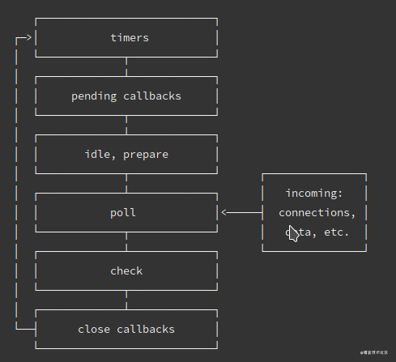
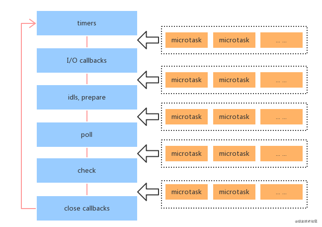

### javascript 为什么是单线程？知道 event loop 吗？实现一个

javascript 可以操作 DOM，如果不是单线程的，当有两个或以上线程操作同一个 DOM 时，浏览器没法判断应该采用哪个线程的结果。

```js
function eventLoop() {
  const taskArr = [];
  while (true) {
    if (taskArr.length) {
      const curTask = taskArr.shift();
      curTask();
    }
  }
}
```

### 介绍浏览器事件循环

JS 在浏览器中的执行是单线程的。若所有事件方法都以同步的方式在主线程中运行，则进程会因为等待耗时任务的执行而被阻塞，效率很低。

为了协调事件，用户交互，脚本，渲染，网络、用户代理等，必须使用事件循环。事件循环是解决 JS 单线程运行阻塞的一种机制。

事件循环的主要机制是任务队列机制。

浏览器维持有一个或多个任务队列，当主线程的任务执行完毕后，就去任务队列中查询是否有待执行的任务，若有则取出任务到主线程执行，若没有，则间隔一段时间后再访问任务队列。

在调用任务执行的过程中，会产生新的任务，浏览器就会不断的执行任务，因此成为事件循环。

1. 所有的「同步任务」都在主线程进行

2. 「异步任务」进入任务队列，任务队列会通知主线程，哪个异步任务可以执行，这个异步任务就会进入主线程。异步任务必须指定回调函数，当主线程开始执行异步任务，其实就是在执行对应的回调函数。

3. 如果主线程的所有同步任务都执行完，系统就会去读取「任务队列」上的异步任务，如果有可以执行的，就会结束等待状态，进入主线程，开始执行。

4. 主线程不断的执行第 3 步

### 哪些是宏任务，哪些是微任务

宏任务: script,setTimeout,setInterval,同步任务,setImmediate(Node),I/O 操作,UI 渲染

微任务: promise.then,process.nextTick(Node),MutationObserver 回调(浏览器端),Object.observe

<span style="color: red;font-size: 18px;">process.nextTick</span>的优先级在微任务队列中是最高的

### setImmediate 的 setTimeout 的区别

setImmediate 大部分浏览器暂时不支持，只有 IE10、11 支持，具体可见 MDN。setImmediate 和 setTimeout 是相似的，但根据它们被调用的时间以不同的方式表现。

- setImmediate 设计用于在当前 poll 阶段完成后 check 阶段执行脚本 。

- setTimeout 安排在经过最小（ms）后运行的脚本，在 timers 阶段执行。

### 浏览器和 Node 实现事件循环的差异

Node 的事件循环是 libuv 实现的:



图中表示的是事件循环包含的 6 个阶段，大体的 task（宏任务）执行顺序是这样的：

- timers 定时器：本阶段执行已经安排的 setTimeout() 和 setInterval() 的回调函数。
- pending callbacks 待定回调：执行延迟到下一个循环迭代的 I/O 回调。
- idle, prepare：仅系统内部使用,可以不必理会。
- poll 轮询：检索新的 I/O 事件;执行与 I/O 相关的回调（几乎所有情况下，除了关闭的回调函数，它们由计时器和 setImmediate() 排定的之外），其余情况 node 将在此处阻塞。
- check 检测：setImmediate() 回调函数在这里执行。
- close callbacks 关闭的回调函数：一些准备关闭的回调函数，如：socket.on('close', ...)。

Node 版本不同，执行顺序有所差异。因为 Node v11 之后， 事件循环的原理发生了变化，和浏览器执行顺序趋于一致，都是每执行一个宏任务就执行完微任务队列。

在 Node v10 及以前，微任务和宏任务在 Node 的执行顺序：

1. 执行完一个阶段的所有任务
2. 执行完 nextTick 队列里面的内容
3. 然后执行完微任务队列的内容

在 Node v10 及以前的版本，微任务会在事件循环的各个阶段之间执行，也就是一个阶段执行完毕，就会去执行微任务队列的任务。



```js
setTimeout(() => {
  console.log("timer1");

  Promise.resolve().then(function () {
    console.log("promise1");
  });
}, 0);

setTimeout(() => {
  console.log("timer2");

  Promise.resolve().then(function () {
    console.log("promise2");
  });
}, 0);

// 浏览器中：
timer1;
promise1;
timer2;
promise2;

// 在Node v10中：
timer1;
timer2;
promise1;
promise2;
```
